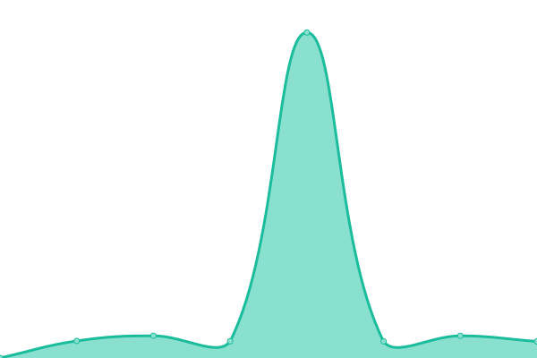

# [📈 Live Status](https://up.zzz.dev): <!--live status--> **🟩 All systems operational**

This repository contains the open-source uptime monitor and status page for [YuLun Shih](http://yulun.me), powered by [Upptime](https://github.com/upptime/upptime).

With [Upptime](https://upptime.js.org), you can get your own unlimited and free uptime monitor and status page, powered entirely by a GitHub repository. We use [Issues](https://github.com/imZack/up.zzz.dev/issues) as incident reports, [Actions](https://github.com/imZack/up.zzz.dev/actions) as uptime monitors, and [Pages](https://up.zzz.dev) for the status page.

<!--start: status pages-->
<!-- This summary is generated by Upptime (https://github.com/upptime/upptime) -->
<!-- Do not edit this manually, your changes will be overwritten -->
<!-- prettier-ignore -->
| URL | Status | History | Response Time | Uptime |
| --- | ------ | ------- | ------------- | ------ |
|  [eit.tw](https://eit.tw) | 🟩 Up | [eit-tw.yml](https://github.com/imZack/up.zzz.dev/commits/master/history/eit-tw.yml) | 

 610ms
     
 | 

<a href="https://up.zzz.dev/history/eit-tw">100.00%</a>
    

|  [Smokeping (zzz.dev)](https://smokeping.zzz.dev/smokeping/) | 🟩 Up | [smokeping-zzz-dev.yml](https://github.com/imZack/up.zzz.dev/commits/master/history/smokeping-zzz-dev.yml) | 

 1241ms
     
 | 

<a href="https://up.zzz.dev/history/smokeping-zzz-dev">100.00%</a>
    

|  Travel Blog | 🟩 Up | [travel-blog.yml](https://github.com/imZack/up.zzz.dev/commits/master/history/travel-blog.yml) | 

 1198ms
     
 | 

<a href="https://up.zzz.dev/history/travel-blog">100.00%</a>
    

|  Tesla Dashboard | 🟩 Up | [tesla-dashboard.yml](https://github.com/imZack/up.zzz.dev/commits/master/history/tesla-dashboard.yml) | 

 563ms
     
 | 

<a href="https://up.zzz.dev/history/tesla-dashboard">100.00%</a>
    

<!--end: status pages-->

[**Visit our status website →**](https://up.zzz.dev)

## 📄 License

- Code: [MIT](./LICENSE) © [YuLun Shih](http://yulun.me)
- Data in the `./history` directory: [Open Database License](https://opendatacommons.org/licenses/odbl/1-0/)
